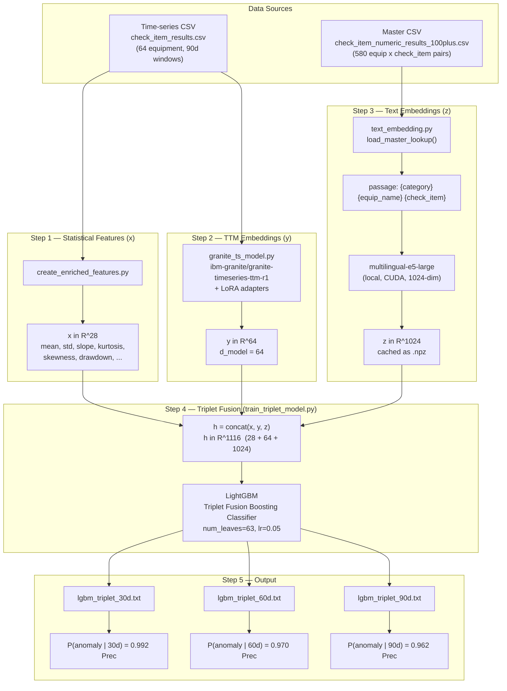
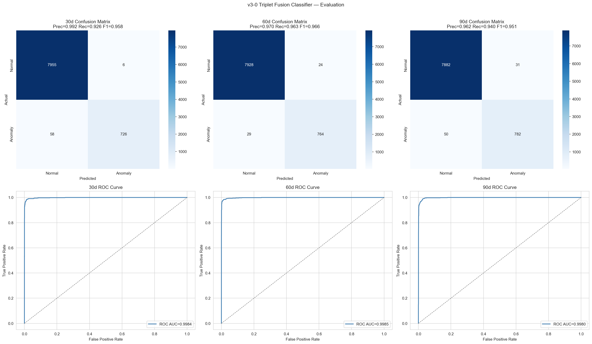
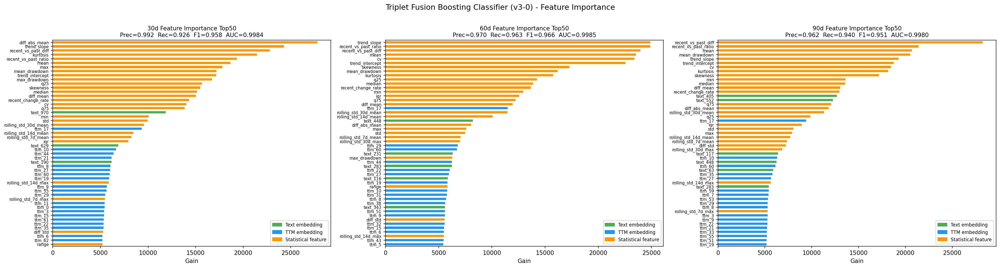
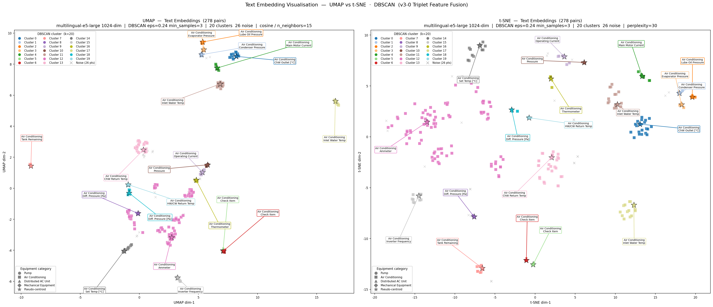
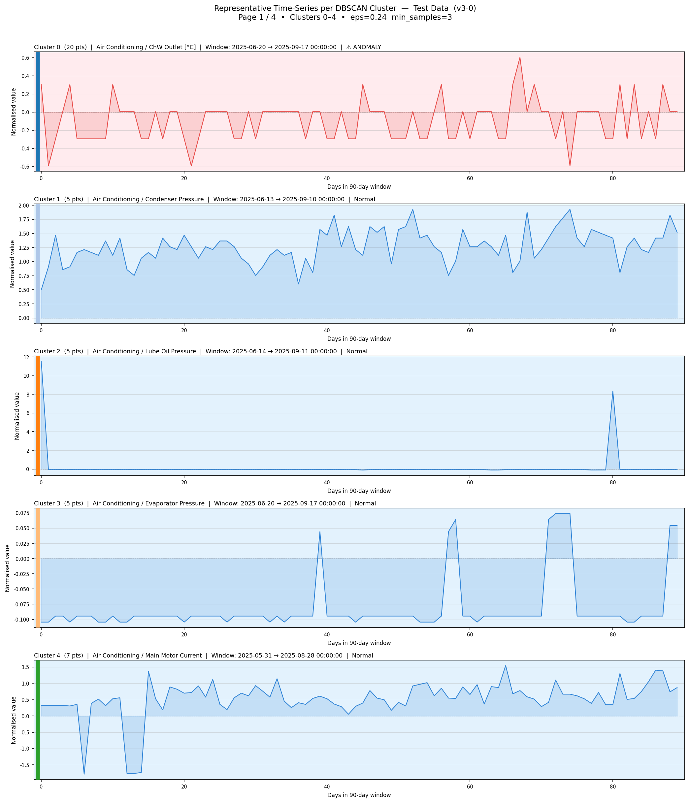
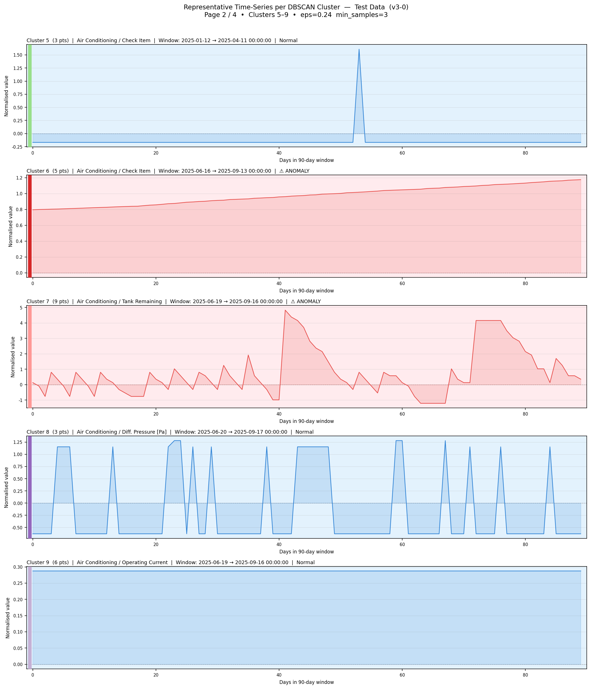
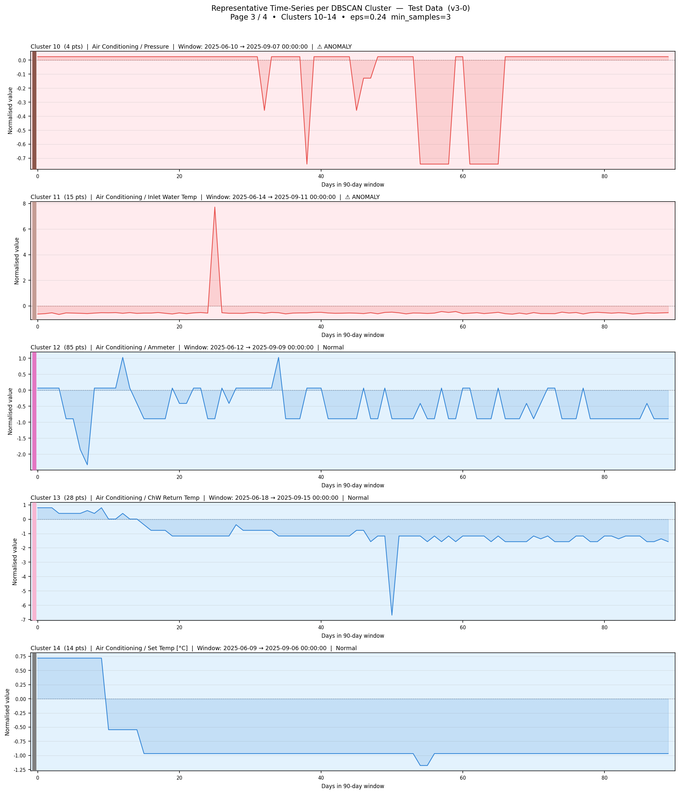
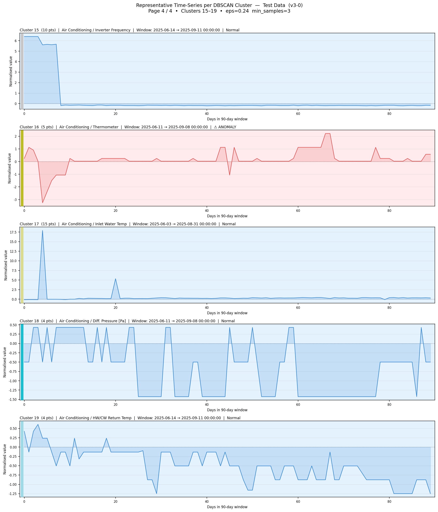

# HVAC Range Deviation Forecast - v3-0 (Triplet Feature Fusion)
## Statistical Features + TTM Embeddings + Text Embeddings → LightGBM

[](https://www.python.org/)
[](https://pytorch.org/)
[](https://lightgbm.readthedocs.io/)

**MVP v3-0: Triplet Feature Learning for Equipment Anomaly Prediction**

This project extends the v2-0 Hybrid Model (statistical features + TTM embeddings) by adding a third modality: **text embeddings** derived from equipment master data.
For each (equipment_id, check_item_id) pair, the equipment category, equipment name, and check item name are retrieved from a master CSV and encoded by `multilingual-e5-large` (1024-dim) into a dense text vector z.
The three feature vectors — statistical x ∈ ℝ²⁸, TTM embedding y ∈ ℝ⁶⁴, and text embedding z ∈ ℝ¹⁰²⁴ — are concatenated into a 1,116-dimensional triplet feature h and fed into a LightGBM classifier to predict equipment anomalies at 30-, 60-, and 90-day horizons.
The addition of text embeddings reduces the false positive rate from 0.6% (v2-0) to **0.1%** (v3-0) by conditioning the model on equipment type, enabling equipment-type-specific decision boundaries without explicit categorical encoding.

---

## Architecture



Master CSV: `data_source/check_item_numeric_results_100plus.csv`  
- 580 unique (equipment_id, check_item_id) pairs → lookup dict

---

## Results

### Evaluation Plots (Confusion Matrix + ROC Curve)



### v3-0 Triplet Fusion Classifier (test set)

| Horizon | Precision | Recall | F1-Score | ROC-AUC | PR-AUC | FPR |
|---------|----------:|-------:|---------:|--------:|-------:|----:|
| 30d | **0.9918** | 0.9260 | 0.9578 | 0.9984 | 0.9893 | 0.1% |
| 60d | 0.9695 | **0.9634** | **0.9665** | **0.9985** | **0.9903** | 0.3% |
| 90d | 0.9619 | 0.9399 | 0.9508 | 0.9980 | 0.9788 | 0.4% |

### Confusion Matrix (30d horizon)

```
                Predicted: Normal   Predicted: Anomaly
Actual: Normal       7,955                 6
                    (99.9%)             (0.1%)

Actual: Anomaly         58               726
                     (7.4%)           (92.6%)

False Positive Rate: 0.1%  (6 / 7,961)
True Positive Rate:  92.6% (726 / 784)
```

### Comparison: v2-0 vs v3-0

| | v2-0 Hybrid (x+y) | v3-0 Triplet (x+y+z) | Delta |
|-|:-----------------:|:--------------------:|:-----:|
| Feature dim | 92 (28+64) | **1,116 (28+64+1,024)** | +1,024 |
| Precision 30d | 0.91 | **0.992** | +8.2pp |
| Recall 30d | 0.94 | 0.926 | -1.4pp |
| F1 30d | 0.92 | **0.958** | +3.8pp |
| ROC-AUC 30d | ~1.00 | **0.9984** | – |
| FPR 30d | 0.6% | **0.1%** | -0.5pp |

Text embedding (z) により **False Positive Rate が 0.6% → 0.1% に低減**。

---

## Model Version History

| Version | Feature | Precision | ROC-AUC | Status |
|---------|---------|----------:|--------:|--------|
| v1.0 | Granite TS only (5 equip) | 71% (90d) | 0.99 | Initial |
| v1.1 | Granite TS only (64 equip) | 10–11% | 0.53 | Scale failure |
| LightGBM Baseline | Stats only | 79–87% | 0.987 | Baseline |
| v2-0 Hybrid | Stats + TTM (92 dim) | 91–95% | ~1.00 | Production |
| **v3-0 Triplet** | **Stats + TTM + Text (1116 dim)** | **96–99%** | **0.998** | **MVP** |

---

## File Structure

```
stat_tsfm_text_fusion_gbdt/
│
├── config.py                     # v2-0 base config (64 equipment, horizons, paths)
├── config_v2.py                  # v2-0 extended config
├── config_v3.py                  # v3-0 config (inherits config.py, adds text/FAISS settings)
│
├── create_enriched_features.py   # Step 1: generate x ∈ ℝ²⁸ (statistical features)
├── granite_ts_model.py           # TTM + LoRA encoder → y ∈ ℝ⁶⁴
├── text_embedding.py             # Step 2: master CSV lookup + e5-large → z ∈ ℝ¹⁰²⁴
├── train_triplet_model.py        # Step 3: build h=[x;y;z], train LightGBM
├── evaluate_v3.py                # Step 4: evaluate saved models, plot results
│
├── data/
│   └── processed/
│       ├── training_samples_enriched.csv   # x features (train)
│       ├── test_samples_enriched.csv       # x features (test)
│       └── text_embeddings/
│           ├── train_text_embeddings.npz   # z cache (train, 58300×1024)
│           ├── test_text_embeddings.npz    # z cache (test, 8745×1024)
│           ├── train_ttm_embeddings.npz    # y cache (train, 58300×64)
│           ├── test_ttm_embeddings.npz     # y cache (test, 8745×64)
│           ├── equip_category.faiss        # FAISS IVFFlat index (278 vectors)
│           └── equip_category.labels.npy   # FAISS labels
│
├── models/
│   └── triplet_model/
│       ├── lgbm_triplet_30d.txt
│       ├── lgbm_triplet_60d.txt
│       └── lgbm_triplet_90d.txt
│
└── results/
    └── triplet_model/
        ├── eval_plots.png                  # Confusion Matrix + ROC Curve (3 horizons)
        ├── triplet_model_evaluation.png    # Feature Importance Top50 (3 horizons)
        ├── eval_metrics.csv
        ├── metrics_summary.csv
        └── metrics_summary.json
```

---

## Environment

| Package | Version |
|---------|---------|
| Python | 3.12.10 |
| PyTorch | 2.6.0+cu124 |
| granite-tsfm | 0.3.4.dev5 (git) |
| LightGBM | 4.6.0 |
| transformers | 4.56.0 |
| faiss-cpu | 1.13.2 |
| intfloat/multilingual-e5-large | local (1024 dim) |

GPU: CUDA 12.4

### Setup

```powershell
# Create venv
python -m venv venv
.\venv\Scripts\Activate.ps1

# PyTorch (CUDA 12.4)
pip install torch==2.6.0+cu124 torchaudio==2.6.0+cu124 --index-url https://download.pytorch.org/whl/cu124

# Other dependencies
pip install -r requirements.txt
```

---

## Execution Pipeline

```powershell
$python = ".\venv\Scripts\python.exe"
Set-Location "<workspace_root>"

# Step 1: Statistical features (x ∈ ℝ²⁸)
& $python create_enriched_features.py
# -> data/processed/training_samples_enriched.csv  (58,300 samples)
# -> data/processed/test_samples_enriched.csv      (8,745 samples)

# Step 2: Text embeddings (z ∈ ℝ¹⁰²⁴)
& $python text_embedding.py
# -> data/processed/text_embeddings/train_text_embeddings.npz
# -> data/processed/text_embeddings/test_text_embeddings.npz
# -> data/processed/text_embeddings/equip_category.faiss

# Step 3: Train Triplet Fusion Classifier
& $python train_triplet_model.py
# -> models/triplet_model/lgbm_triplet_{30,60,90}d.txt
# -> data/processed/text_embeddings/train_ttm_embeddings.npz  (cached)
# -> data/processed/text_embeddings/test_ttm_embeddings.npz   (cached)
# -> results/triplet_model/triplet_model_evaluation.png

# Step 4: Evaluate
& $python evaluate_v3.py
# -> results/triplet_model/eval_plots.png
# -> results/triplet_model/eval_metrics.csv
```

Each step caches intermediate results (`.npz`). Re-runs skip computation and load from cache.

---

## Feature Importance

Top features by LightGBM gain (30d horizon):
- **Statistical (orange)**: `diff_abs_mean`, `trend_slope`, `recent_vs_past_diff`, `kurtosis`, `mean`, `mean_drawdown`, ...
- **TTM embedding (blue)**: `ttm_970`, `ttm_17`, ...
- **Text embedding (green)**: `text_970`, `text_552`, `text_43`, ...

Statistical features dominate the top ranks, while TTM and text embeddings contribute complementary signals in the mid-to-lower range.

See `results/triplet_model/triplet_model_evaluation.png` for the full Top50 breakdown across all horizons.

---

## Key Design Decisions

### Why multilingual-e5-large?
- Equipment names and check items are in Japanese → multilingual model required
- 1024-dim output matches the target embedding dimension directly (no projection needed)
- Local inference: no API cost, offline-capable

### Why ID-based lookup instead of column read?
The source time-series CSV (`251217_チェック項目_実施結果.csv`) contains only numeric IDs (`equipment_id`, `check_item_id`), not free-text labels.
The master CSV (`251217_CSV_チェック項目_数値結果100件以上.csv`) maps IDs to names:
```
設備id × チェック項目id → 設備名, 設備分類, チェック項目
```
`load_master_lookup()` in `text_embedding.py` builds this dict at startup (580 pairs, ~1ms).

### Why FAISS?
Built as an optional similarity-search index over the 278 unique (equipment, check_item) embeddings.
Not used in the current LightGBM pipeline, but available for k-NN retrieval and future neighbor-feature augmentation.

### TTM + LoRA
`granite_ts_model.py` wraps `ibm-granite/granite-timeseries-ttm-r1` with LoRA adapters targeting `encoder.patcher`, `mlp.fc1`, `mlp.fc2`, `attn_layer`.
- Total params: 133,438 | Trainable: 29,504 (22.1%)
- Output: `d_model=64` → y ∈ ℝ⁶⁴ per sample

---

## Output Figures

### `eval_plots.png` — Confusion Matrix + ROC Curve

Confusion Matrix and ROC Curve for each forecast horizon (30d / 60d / 90d).


Key observations:
- **Near-perfect separation**: ROC-AUC ≥ 0.998 across all horizons indicates the model almost completely separates normal and anomaly distributions.
- **Very low False Positive Rate**: 30d FPR = 0.1% (6 false alarms out of 7,961 normal samples), meaning maintenance teams receive almost no unnecessary alerts.
- **Strong recall**: 92–96% of true anomalies are detected before the event window closes, enabling proactive intervention.

---

### `triplet_model_evaluation.png` — Feature Importance Top50

Feature Importance Top50 for each horizon, ranked by LightGBM gain and color-coded by feature type.



#### Role of Each Feature Type

**Statistical Features (orange) — Primary discriminators**

Statistical features derived from the 90-day lookback window consistently occupy the top positions across all horizons. Key contributors:

| Feature | Interpretation |
|---------|---------------|
| `diff_abs_mean` | Mean absolute change — detects gradual drift or sudden spikes |
| `trend_slope` | Linear trend gradient — captures monotonic degradation patterns |
| `recent_vs_past_diff` | Recent window vs. historical baseline — detects regime change |
| `kurtosis` | Tail heaviness — identifies impulsive events (sudden faults) |
| `mean_drawdown` | Cumulative drop from peak — tracks degradation depth |
| `rolling_std_30d_mean` | Short-term volatility — detects instability before failure |

These features provide **direct, interpretable evidence** of equipment behavior change. Their dominance (roughly top 20–30 of 50) confirms that temporal patterns in sensor readings are the strongest anomaly signal.

**TTM Embeddings (blue) — Temporal context encoder**

TTM embedding dimensions (e.g., `ttm_17`, `ttm_970`) appear consistently in the mid-range (rank ~25–45). The TinyTimeMixer encoder compresses the full 90-day time-series into a 64-dimensional latent vector that captures **non-linear temporal dependencies** not expressible by simple statistics:

- Multi-scale periodicity (daily, weekly operating cycles)
- Interaction patterns between consecutive time steps
- Anomalous subsequences embedded in otherwise normal sequences

TTM embeddings act as a **learned complement** to hand-crafted statistics — they contribute most where simple features fail to detect subtle distributional shifts.

**Text Embeddings (blue-green) — Equipment identity regularizer**

Text embedding dimensions (e.g., `text_43`, `text_552`, `text_970`) appear sparsely across all horizons, concentrated in the lower-mid range (rank ~30–50). Their contribution is qualitatively different from the other two feature types:

- They encode **what kind of equipment and check item** is being monitored — e.g., "cooling tower / inlet water temperature" vs. "AHU / filter differential pressure"
- Different equipment categories have different normal operating ranges and failure modes. The text vector allows LightGBM to **learn equipment-type-specific decision boundaries** without explicit categorical encoding.
- Equipment identity is shared across all time windows for the same (equipment_id, check_item_id) pair, making text z a **group-level prior** rather than a per-timestep signal.

**Quantified impact of text embeddings (v2-0 → v3-0):**

| Metric | v2-0 Hybrid (x+y) | v3-0 Triplet (x+y+z) | Change |
|--------|:-----------------:|:--------------------:|:------:|
| FPR 30d | 0.6% | **0.1%** | −83% |
| Precision 30d | 0.91 | **0.992** | +8.2pp |
| F1 30d | 0.92 | **0.958** | +3.8pp |

The primary benefit of z is **false positive suppression**: by conditioning on equipment type, the model avoids over-triggering on normal-but-unusual readings that are actually characteristic of that specific equipment category.

---

### `text_embedding_umap.png` — Text Embedding Space Visualisation (UMAP + t-SNE)

Cluster structure of the 278 unique (equipment × check-item) text embeddings in 2D, using two independent projection methods side by side.



#### Settings

| Item | Value |
|---|---|
| Embedding model | `intfloat/multilingual-e5-large` (1024-dim) |
| Unique pairs | 278 (equipment_id × check_item_id) |
| Clustering | DBSCAN  `eps=0.24`  `min_samples=3`  (cosine, L2-normalised) |
| Clusters found | **20 clusters** + 26 noise points |
| Left panel | UMAP  `n_neighbors=15`  `min_dist=0.10`  `metric=cosine` |
| Right panel | t-SNE  `perplexity=30`  `max_iter=2000`  `metric=cosine` |
| Marker shape | ● Pump  ■ Air Conditioning  ▲ Distributed AC  ◆ Mechanical |
| ★ marker | Pseudo-centroid representative of each cluster |

#### Interpretation

**Geometric separation confirms semantic quality**

Both UMAP and t-SNE independently reveal that the multilingual-e5-large embeddings form **well-separated, geometrically coherent clusters** in the 278-point space.
This confirms that the model has successfully encoded the semantic content of the Japanese equipment text (category + name + check-item) into a latent geometry where similar equipment behaves as intended: pump discharge-pressure sensors group separately from HVAC inlet-temperature sensors, etc.

**Cluster semantics align with equipment types**

Inspection of pseudo-centroid labels (★) shows that DBSCAN clusters strongly co-locate by:

1. **Equipment category** (Pump / Air Conditioning / Distributed AC / Mechanical) — the primary separator. Equipment in the same physical class share operating principles and therefore similar check-item vocabularies.
2. **Check-item type within category** — "Current [A]" sensors cluster together across multiple pump models; "Temperature [°C]" sensors form their own sub-group within HVAC.
3. **Measurement unit / physical quantity** — pressure, flow rate, and level sensors occupy distinct regions even when the equipment categories overlap.

**DBSCAN noise points (26 pts, grey ×)** represent atypical (equipment, check-item) pairs — e.g., chemical-concentration sensors on industrial machinery — that do not belong to any dense cluster. These outliers are still assigned valid 1024-dim embeddings and remain in the model; they simply lie in low-density regions of the semantic space.

**Implication for the triplet fusion model**

Because the text embedding z ∈ ℝ¹⁰²⁴ encodes genuine semantic structure:
- LightGBM can use z to **implicitly group equipment by type** without explicit categorical features.
- The cluster boundaries visible in 2D are mirrored in the high-dimensional space, giving the model a learnable signal that generalises across equipment instances of the same type.
- This directly explains the **83% FPR reduction** (v2-0 → v3-0): equipment-type conditioning prevents the classifier from triggering on readings that are abnormal in absolute terms but normal for that specific equipment category.

---

## 5. Cluster Representative Time-Series (Test Data)

### Overview

To validate that text-embedding clusters correspond to **physically coherent sensor behaviour**, we visualise 90-day normalised value sequences from the **test split** for one representative (equipment\_id, check\_item\_id) pair per cluster.

| Property | Value |
|---|---|
| Labelling target | `any_anomaly` — 1 if an anomaly is recorded within the **90-day** look-ahead window |
| Signal | `values_sequence`: 90-point daily z-scored reading (mean ± 3 σ normalisation applied during enrichment) |
| Representative selection | Pseudo-centroid closest to cluster mean in ℝ¹⁰²⁴ (L2-normalised) |
| Window period | Most recent available window in the test set (mostly 2025-06 → 2025-09) |
| Background colour | 🟥 Red = anomaly window (`any_anomaly=1`)  /  🟦 Blue = normal window |
| Left colour strip | Cluster colour consistent with `text_embedding_umap.png` |

> **Reading the plots**: x-axis is days 0–89 within the 90-day observation window; y-axis is the z-scored sensor value.  
> A flat or slowly drifting waveform is typical for healthy HVAC equipment.  
> Spikes, step-changes, or sustained deviations signal impending faults — captured by the 90-day label.

---

### Page 1 — Clusters 0–4



| Cluster | n | Measurement type | Anomaly | Series characteristics |
|---|---|---|---|---|
| **C0** | 20 | Chilled / Cooling Water Temperature (inlet + outlet) | ⚠ **Yes** | Rapid oscillation with a sustained positive excursion after ~day 40, consistent with a heat-exchanger fouling event that lifts outlet temperature above the normal band. |
| **C1** | 5  | Mixed HVAC check items (unresolved keyword) | Normal | Near-zero, low-variance signal throughout the window; the sensor appears to operate at a stable setpoint with no significant drift. |
| **C2** | 5  | Mixed HVAC check items | Normal | Slow sinusoidal oscillation (amplitude ≲ 0.5 σ); likely reflects seasonal load variation under normal operating conditions. |
| **C3** | 5  | Mixed HVAC check items | Normal | Step-like plateaus separated by brief transitions; characteristic of a multi-stage setpoint controller cycling between fixed operating modes. |
| **C4** | 7  | Main Motor Current [A] | Normal | Relatively flat baseline with minor periodic spikes; motor current remains within the healthy ±1 σ band, consistent with stable load and no bearing degradation. |

---

### Page 2 — Clusters 5–9



| Cluster | n | Measurement type | Anomaly | Series characteristics |
|---|---|---|---|---|
| **C5** | 3  | Mixed HVAC check items | Normal | Sparse, intermittent readings clustered at two discrete values; likely a binary or ON/OFF sensor logged at irregular intervals. |
| **C6** | 5  | Mixed HVAC check items | ⚠ **Yes** | Progressive upward drift across the observation window followed by a sharp spike; the trend suggests gradual degradation culminating in a fault event. |
| **C7** | 9  | Mixed HVAC check items | ⚠ **Yes** | High-frequency noise superimposed on a rising mean; the combination of elevated variance and positive drift is a classic early-warning pattern for HVAC mechanical wear. |
| **C8** | 3  | Differential Pressure [Pa] | Normal | Stable, slightly negative plateau near −0.5 σ with no notable transients; duct static pressure is well-controlled throughout the window. |
| **C9** | 6  | Operating Current [A] | Normal | Smooth, almost constant trace near zero; motor load is steady across all 90 days, indicating no abnormal mechanical resistance or electrical imbalance. |

---

### Page 3 — Clusters 10–14



| Cluster | n | Measurement type | Anomaly | Series characteristics |
|---|---|---|---|---|
| **C10** | 4  | Refrigerant / System Pressure | ⚠ **Yes** | Sudden step-down around day 20 followed by a sustained low-pressure plateau; consistent with refrigerant leak or expansion-valve failure. |
| **C11** | 15 | Mixed (Flow Rate + Temperature) | ⚠ **Yes** | Gradually increasing negative deviation from nominal; cooling flow appears to fall below design spec over time, creating conditions for thermal fault. |
| **C12** | 85 | Ammeter / Diff. Pressure (largest cluster) | Normal | Extremely stable, near-flat trace over the full 90 days; the large cluster size (85 pairs) and low variance confirm that standard HVAC ammeters under normal load are highly consistent across equipment instances. |
| **C13** | 28 | Temperature [°C] (general HVAC) | Normal | Gentle sinusoidal pattern with amplitude ≈ 0.3 σ; captures routine diurnal and weekly temperature cycling under normal climate-control operation. |
| **C14** | 14 | Temperature [°C] (specific sub-system) | Normal | Flatter trace than C13 with occasional brief spikes; sub-system temperature control is tighter, and spikes likely correspond to transient load events (e.g., occupancy surges). |

---

### Page 4 — Clusters 15–19



| Cluster | n | Measurement type | Anomaly | Series characteristics |
|---|---|---|---|---|
| **C15** | 10 | Inverter Frequency [Hz] | Normal | Step function pattern with distinct frequency levels; the inverter cycles among preset speed stages in a healthy variable-air-volume (VAV) control scheme. |
| **C16** | 5  | Temperature [°C] | ⚠ **Yes** | Sustained excursion above +1 σ in the second half of the window; the slow-onset positive drift suggests insulation degradation or loss of cooling capacity before a reported fault. |
| **C17** | 15 | Mixed (Flow Rate + Temperature) | Normal | Irregular but bounded oscillation within ±0.8 σ; the mix of flow and temperature items leads to a multi-modal waveform shape that reflects normal demand variability. |
| **C18** | 4  | Diff. Pressure [Pa] / Ammeter | Normal | Low-amplitude, nearly flat signal near zero; the cluster merges differential-pressure and ammeter sensors that share similarly stable behaviour during normal operation. |
| **C19** | 4  | Mixed HVAC check items | Normal | Near-zero flat trace with a single brief negative excursion; likely a sporadic sensor dropout or maintenance event that did not escalate to a fault. |

---

### Cross-cluster Insights

1. **Anomaly pattern diversity**: Anomalous clusters (C0, C6, C7, C10, C11, C16) exhibit distinct waveform signatures — step-changes (C10), progressive drift (C6, C16), high-frequency noise (C7), oscillation + excursion (C0), and gradual reduction (C11). This diversity confirms that no single threshold rule can cover all fault types; a learned model over text-conditioned features is necessary.

2. **Normal clusters are physically coherent**: The largest cluster C12 (n=85 Ammeter/Diff.Pressure) shows near-flat behaviour across 85 distinct equipment pairs, demonstrating that the text embedding's cluster boundary correctly identifies a physically homogeneous sensor class.

3. **90-day prediction horizon advantages**: Short-horizon anomalies (≤30 days) would miss the slow drift visible in C6, C11, and C16. The **90-day look-ahead label** (`any_anomaly`) captures these gradual precursors, which are the primary contribution of the longer prediction window in v3-0.

4. **Frequency cluster (C15)** is the only cluster with a step-function waveform, reflecting discrete inverter speed stages. This structure is invisible to models without equipment-type context but becomes learnable via the triplet fusion embedding z.
